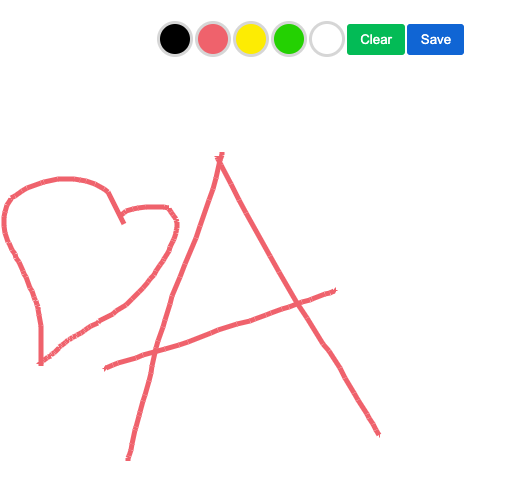

# Advent of Code

Des petits projets proposés aux étudiants.

Le degré de difficulté est mentionné

 Base de données

Projet
- Titre
- Description courte
- Consigne
- Fichiers fournis
  - Un ensemble de fichiers sources
- Niveau de difficulté (1 à 5)
- Langages utilisés
  - JS, HTML, CSS
- Techniques utilisées
  - Formulaire, HTTP

<!-- TOC -->
- [Advent of Code](#advent-of-code)
  - [Morpion -- OK](#morpion----ok)
  - [Calculatrice -- OK](#calculatrice----ok)
    - [Notions](#notions)
    - [Langages](#langages)
  - [MarketPlace](#marketplace)
  - [GuessANumber](#guessanumber)
  - [Cadavre exquis](#cadavre-exquis)
  - [Museum](#museum)
  - [TodoList](#todolist)
  - [Encyclopédie Savoir relatif et Absolu](#encyclopédie-savoir-relatif-et-absolu)
  - [Memory](#memory)
  - [Formulaire de contact](#formulaire-de-contact)
  - [PasswordGenerator -- OK](#passwordgenerator----ok)
  - [PasswordChecker -- OK](#passwordchecker----ok)
  - [ChatWebSocket](#chatwebsocket)
  - [SnakeGame](#snakegame)
  - [SuperSimon -- OK](#supersimon----ok)
  - [Paint](#paint)
  - [Loan Calculator](#loan-calculator)
  - [IP Validator](#ip-validator)
  - [Securité Sociale Num Checker](#securité-sociale-num-checker)
  - [Outil pour bijoutier](#outil-pour-bijoutier)
  - [Calculateur d'âge](#calculateur-dâge)
<!-- TOC -->

## Morpion -- OK

Jeu du morpion
Graphisme amélioré

Bonus:
- Stockage du score en LocalStorage
- Gestion des noms

## Calculatrice -- OK

Créer une calculatrice : Créez une calculatrice en JavaScript qui peut effectuer les opérations de base comme l'addition, la soustraction, la multiplication et la division.
On y trouvera aussi les boutons AC (remise à zéro) et DEL (Suppression du dernier chiffre saisi)

### Notions

- Sélecteur CSS
- Manipulation du DOM
- EventListener
- Concaténation
- Types de données (integer)
- try  catch

### Langages

- JS
- HTML
- CSS

## MarketPlace

Un fichier JSON est fourni.
Il contient un catalogue de produits.

L'étudiant doit l'afficher sous forme de boutique en ligne.

Bonus:
- Boutons d'achat
- Gestion d'un panier

## GuessANumber

Créer un jeu de devinette de nombres : Créez un jeu où l'utilisateur doit deviner un nombre choisi au hasard entre 1 et 100. Si la réponse est incorrecte, donnez des indices à l'utilisateur si le nombre est trop élevé ou trop bas. L'utilisateur a un nombre limité de tentatives pour deviner le bon nombre.

## Cadavre exquis

Générateur de citations sur le modèle du cadavre exquis.
Créer un générateur de citations aléatoires : Créez une application qui génère des citations aléatoires à chaque fois qu'un bouton est cliqué.
Des éléments de phrase sont piochés au hasard.

Bonus:
- Envoi par mail

Déclinaisons:
- Générateur d'excuses foireuses

## Museum

Un json est fourni et contient les urls vers des oeuvres d'art.
Chacune est accompagnée d'un descriptif et d'un lieu d'exposition.

Créer une galerie d'images : Créez une galerie d'images en utilisant JavaScript et HTML/CSS. Les images doivent être cliquables et doivent s'ouvrir dans une fenêtre modale.

L'étudiant doit afficher la galerie à partir du JSON.
Les images sont cliquables et s'agrandissent dans une modale.

Bonus:
- Liens vers le musée
- Boutons d'impression

## TodoList

Créer une application de gestion de tâches : Créez une application qui permet à l'utilisateur de créer, modifier et supprimer des tâches. Les tâches doivent être stockées en utilisant un tableau JavaScript.

Bonus:
- Filtres
- Catégories

## Encyclopédie Savoir relatif et Absolu

Sur le modèle du livre de Bernard Werber, une base de connaissances de faits intéressants.

## Memory

Jeu du memory

## Formulaire de contact

Formulaire classique

Bonus:
- Envoi de mail
- Choix des champs à afficher

## PasswordGenerator -- OK

Générateur

Bonus:
- Choix de la politique de mot de passe
- Interaction avec Pawned (le site)

## Password Validator -- OK

A partir d'une politique de mot de passe sélectionnée, le mot de passe saisi est vérifié pour voir s'il est assez robuste.

## ChatWebSocket

Créer une application de chat : Créez une application de chat en utilisant le DOM et les WebSockets. Les utilisateurs doivent être en mesure de se connecter et de communiquer en temps réel avec les autres utilisateurs connectés.

## SnakeGame

Jeu du snake

## SuperSimon -- OK

Jeu du Supersimon

## Paint

Application de dessin

## Loan Calculator

Calculateur des intérêts

## IP Validator

Formulaire validation IP

Bonus:
- Masque

## Securité Sociale Num Checker

## Outil pour bijoutier

Calculer le périmètre d'une bague
Calculs de densité

## Calculateur d'âge

Formulaires qui contient les inputs suivants:
- jour
- mois
- année

Le programme affiche l'age

Améliorations possibles:
- Vérifications
- Ajout de résultats rigolos